# 🤖 LLM Text Preprocessing Foundations
## Tokenization, Embeddings, and Data Sampling for Language Models

<div align="center">
  
</div>

[](https://www.python.org/)
[](https://pytorch.org/)
[](https://github.com/openai/tiktoken)
[](https://jupyter.org/)
[](LICENSE)

> **Enterprise Architecture (AREP)** - Machine Learning Bootcamp Assignment  
> Implementing the complete text preprocessing pipeline for Large Language Models from scratch, based on Chapter 2 of Sebastian Raschka's *"Build a Large Language Model (From Scratch)"*.

---

## 📋 **Table of Contents**

- [Overview](#-overview)
- [Project Structure](#-project-structure)
- [The LLM Preprocessing Pipeline](#-the-llm-preprocessing-pipeline)
  - [1. Tokenization with BPE](#1-tokenization-with-bpe)
  - [2. Data Sampling with Sliding Windows](#2-data-sampling-with-sliding-windows)
  - [3. Token Embeddings](#3-token-embeddings)
  - [4. Positional Embeddings](#4-positional-embeddings)
- [Experimental Analysis](#-experimental-analysis)
- [Key Insights](#-key-insights)
- [Installation and Usage](#-installation-and-usage)
- [Author](#-author)
- [License](#-license)
- [Additional Resources](#-additional-resources)

---

## 🌐 **Overview**

This project implements the **complete data preprocessing pipeline** required to prepare text data for training Large Language Models (LLMs) such as GPT. The implementation covers:

- 🔤 **Byte Pair Encoding (BPE) tokenization** using OpenAI's `tiktoken`
- 📊 **Sliding window data sampling** for sequence generation
- 🧠 **Token embeddings** as learned dense vector representations
- 📍 **Positional embeddings** to encode sequential order
- 🔬 **Experimental analysis** of hyperparameter impact on training data

### Business Context

This assignment is part of an **Enterprise Architecture** course, where understanding the foundational components of LLMs is critical for:

- **Architectural Decision-Making**: Choosing appropriate tokenization strategies for domain-specific applications
- **System Integration**: Understanding how LLMs process and represent natural language
- **Performance Optimization**: Analyzing trade-offs in context window sizing and data sampling
- **Agentic AI Systems**: Building conversational agents and autonomous systems that leverage language understanding

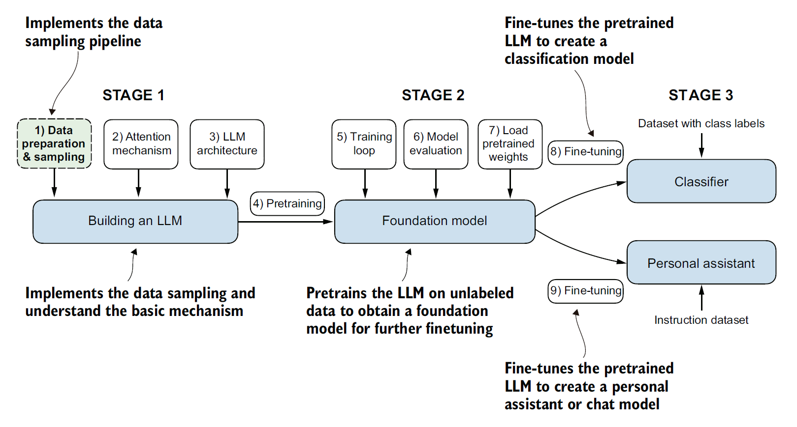

*The three main stages of building an LLM from scratch: data preprocessing, model architecture, and training*

---

## 📁 **Project Structure**

```
AREP-homework-3-llm-text-embeddings/
├── embeddings.ipynb                  # Complete preprocessing pipeline implementation
├── the-verdict.txt                   # Sample text data (Edith Wharton short story)
├── README.md                         # Project documentation
├── LICENSE                           # Apache License 2.0
└── assets/
    └── images/                       # Visualization assets
```

### Dataset

**Source Text**: *"The Verdict"* by **Edith Wharton** (1908)
- **Genre**: Short fiction (public domain)
- **Length**: ~20,479 characters
- **Purpose**: Demonstrate tokenization, sampling, and embedding techniques on literary prose

---

## 🔄 **The LLM Preprocessing Pipeline**

### **1. Tokenization with BPE**

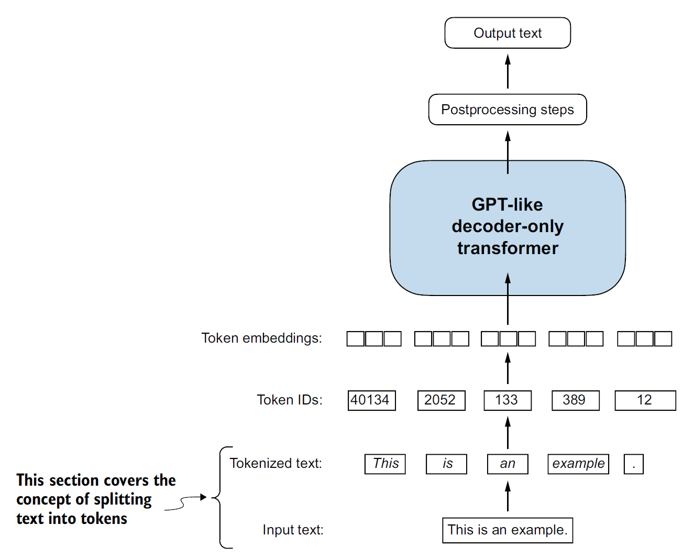

*The tokenization process converts raw text into processable token IDs*

#### **Why Tokenization Matters**

Neural networks cannot process raw text strings. **Tokenization** converts text into discrete units (tokens) that can be mapped to numerical IDs and subsequently embedded as vectors.

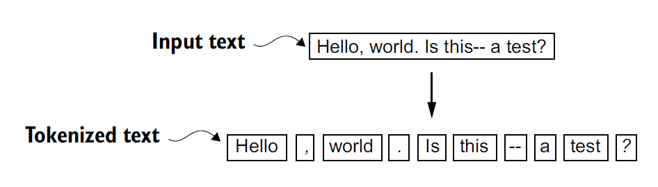

*Example of text split into tokens using BPE*

#### **Byte Pair Encoding (BPE) Algorithm**

BPE balances three competing objectives:

| Approach | Vocabulary Size | Sequence Length | Handling Unknown Words |
|----------|-----------------|-----------------|------------------------|
| **Character-level** | ~100 | Very long | ✅ Always works |
| **Word-level** | ~1M+ | Short | ❌ Fails on rare words |
| **BPE (subword)** | ~50K | Optimal | ✅ Decomposes to subunits |

**Key Advantages of BPE:**
- Common words → Single token (e.g., `"the"` → `[1]`)
- Rare words → Multiple subword tokens (e.g., `"unbelievable"` → `["un", "believ", "able"]`)
- **Zero out-of-vocabulary (OOV) problem**: Any word can be decomposed into learnable subunits

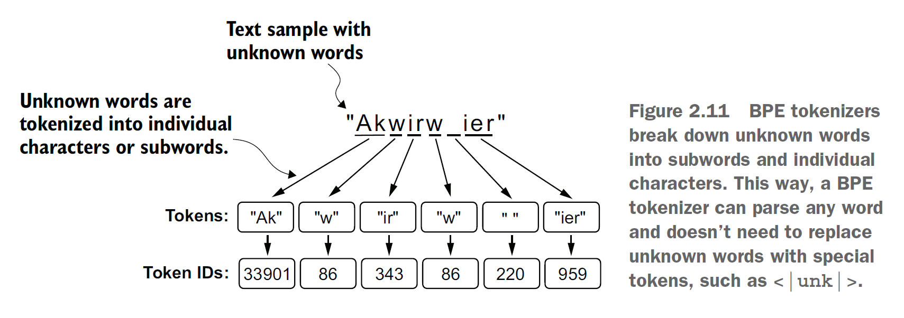

*BPE decomposes words into optimal subword units based on frequency analysis*

#### **Implementation with `tiktoken`**

```python
import tiktoken

# GPT-2 tokenizer (50,257 tokens)
tokenizer = tiktoken.get_encoding("gpt2")

text = "I HAD always thought Jack Gisburn rather a cheap genius"
tokens = tokenizer.encode(text)
print(tokens)
# Output: [40, 367, 2885, 1464, 3619, 402, 271, 10899, 2138, 257, 7026, 18253]
```

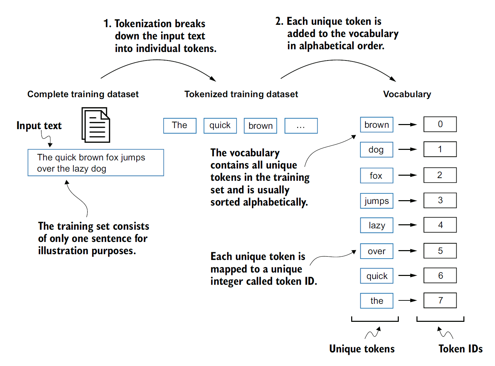

*Tokens are mapped to unique integer IDs from the vocabulary*

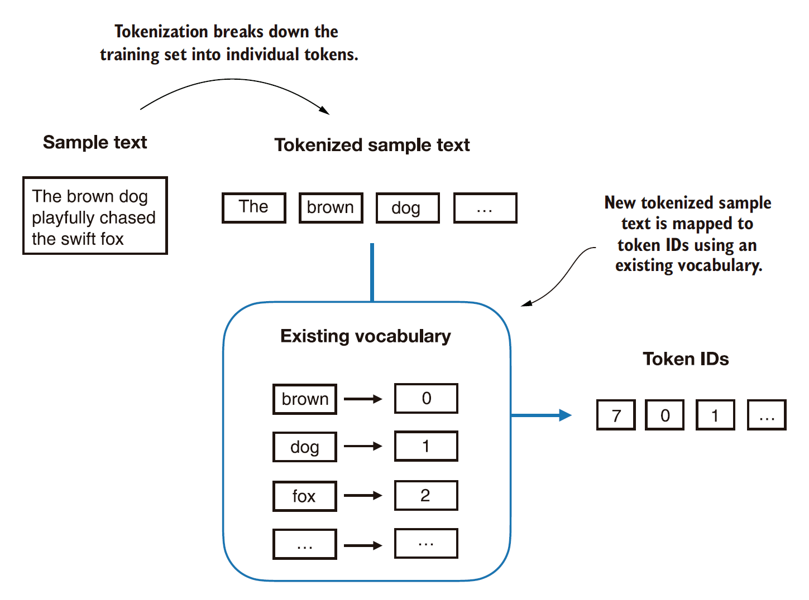

*Example tokenization workflow with a simplified vocabulary*

#### **Encoding and Decoding**

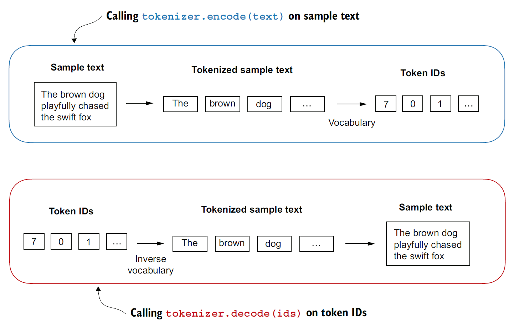

*Bidirectional conversion: text ↔ token IDs*

#### **Special Tokens**

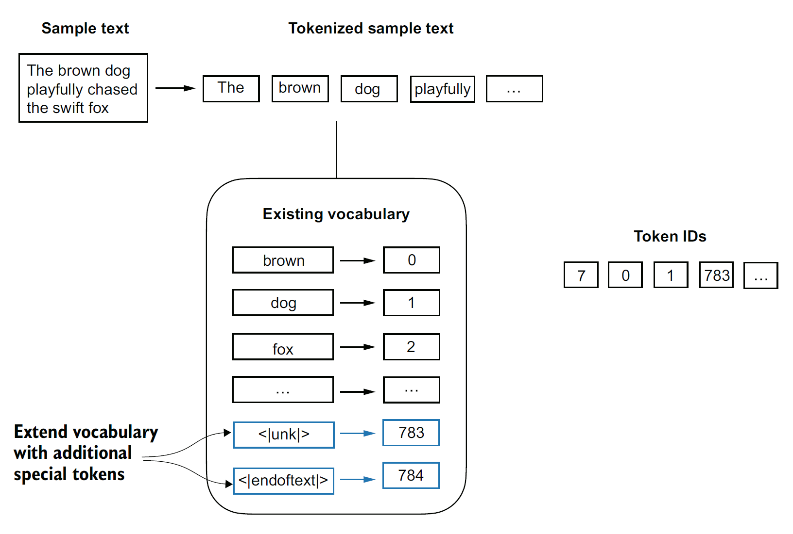

*Special tokens like `<|endoftext|>` mark boundaries between independent text segments*

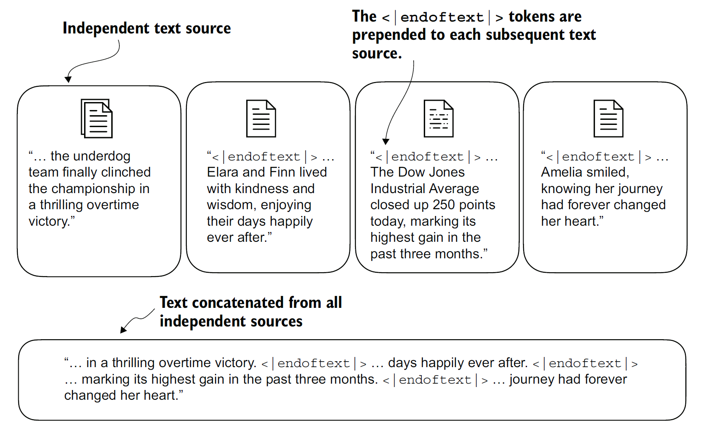

*Example of using `<|endoftext|>` to separate different documents in training data*

---

### **2. Data Sampling with Sliding Windows**

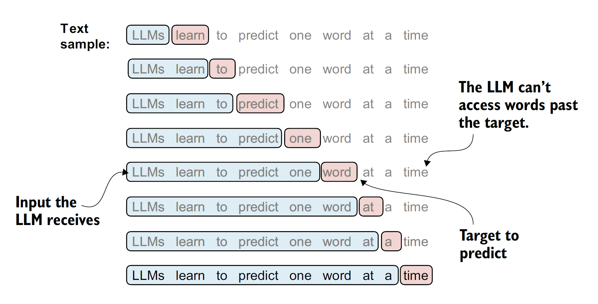

*Sliding window approach creates overlapping training samples*

#### **Why Sliding Windows?**

LLMs learn to **predict the next token** given a fixed-length context window. The sliding window technique with configurable `stride` enables:

1. **Data Augmentation**: Generate multiple training samples from a single text
2. **Contextual Diversity**: Same tokens appear in different positional contexts
3. **Efficient Learning**: Model sees varied local patterns

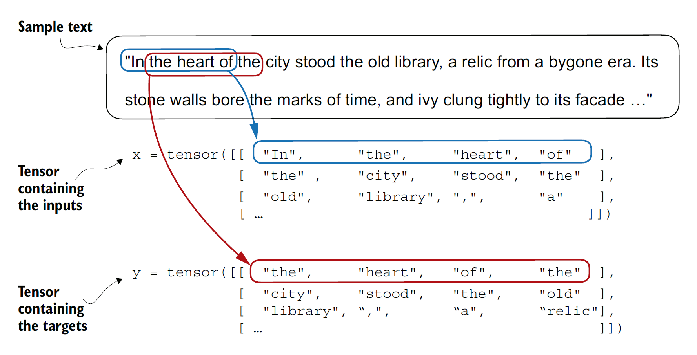

*Detailed example of sliding window with `max_length=4` and `stride=1`*

#### **Mathematical Formulation**

Given tokenized text of length $L$, context window `max_length = m`, and stride $s$:

$$
N_{\text{samples}} = \left\lfloor \frac{L - m}{s} \right\rfloor + 1
$$

**Example:**
- Text length: $L = 5145$ tokens
- Context window: $m = 4$
- Stride: $s = 1$

$$
N_{\text{samples}} = \frac{5145 - 4}{1} + 1 = 5142 \text{ samples}
$$

#### **Stride Impact Analysis**

| Stride | Samples Generated | Overlap | Training Time | Data Efficiency |
|--------|-------------------|---------|---------------|-----------------|
| `s = 1` | $L - m + 1$ | Maximum | Highest | Best |
| `s = m/2` | $\approx 2(L/m)$ | 50% | Medium | Good |
| `s = m` | $L/m$ | None | Lowest | Acceptable |

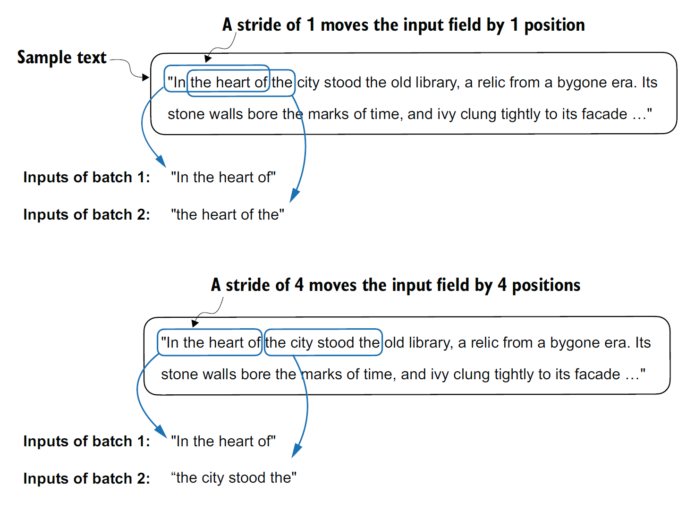

*When `stride = max_length`, no overlap occurs between consecutive samples*

#### **Input-Target Pair Generation**

Each sample consists of:
- **Input**: Tokens at positions `[i, i+1, ..., i+m-1]`
- **Target**: Tokens at positions `[i+1, i+2, ..., i+m]` (shifted by 1)

**Example:**
```
Text: [I, HAD, always, thought, Jack, Gisburn, rather]

Sample 1:
  Input:  [I, HAD, always, thought]
  Target: [HAD, always, thought, Jack]

Sample 2:
  Input:  [HAD, always, thought, Jack]
  Target: [always, thought, Jack, Gisburn]
```

The model learns: *"Given `[I, HAD, always]`, predict `thought`"*

---

### **3. Token Embeddings**

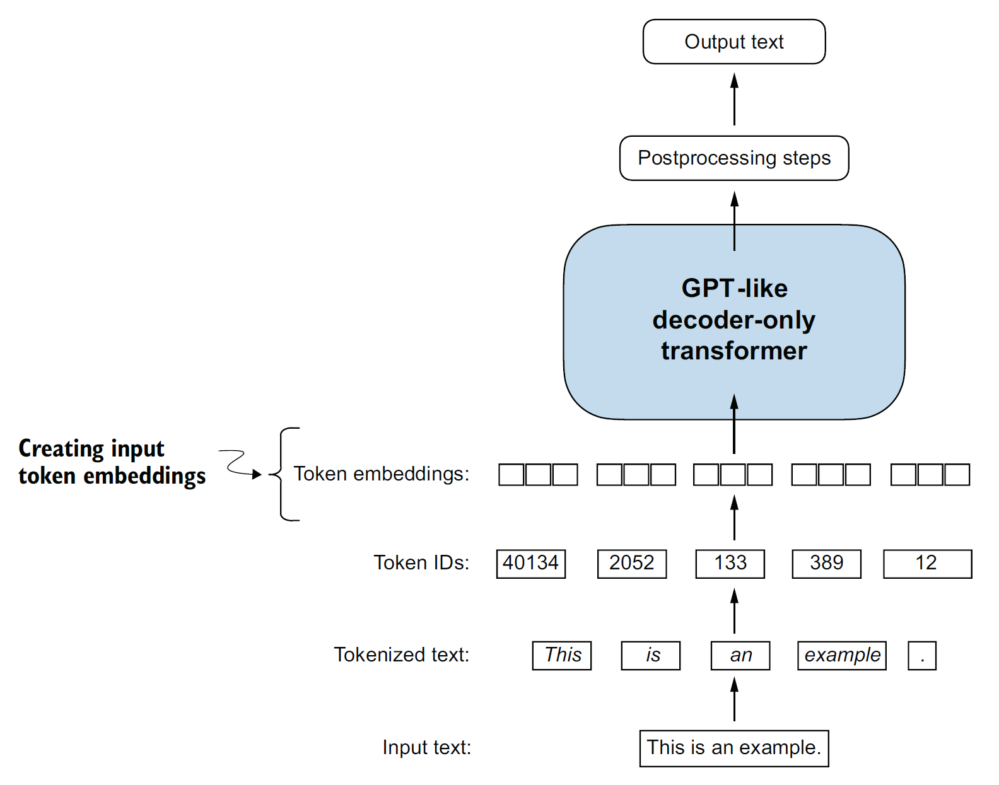

*Complete flow from token IDs to embedded vectors*

#### **Why Embeddings Encode Meaning**

**Problem**: Neural networks require continuous, differentiable inputs. Token IDs are discrete integers.

**Solution**: Learn a **dense vector representation** for each token.

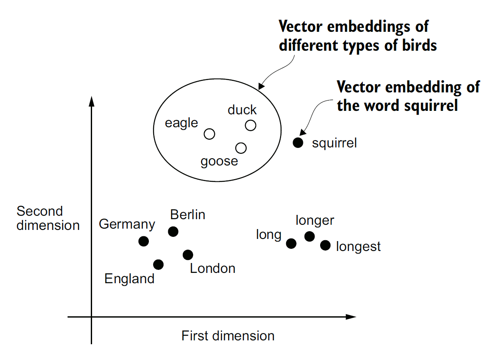

*Simplified 2D visualization of embedding space (actual LLMs use 256-1536 dimensions)*

#### **One-Hot Encoding vs. Embeddings**

| Method | Dimensionality | Semantic Relationships | Gradient Flow |
|--------|----------------|------------------------|---------------|
| **One-Hot** | $V = 50,257$ | ❌ All equidistant | ❌ Sparse |
| **Embeddings** | $d = 256$ | ✅ Similar words → Similar vectors | ✅ Dense |

**One-Hot Example:**
```python
"cat" = [0, 0, ..., 1, ..., 0]  # 50,257-dimensional vector with single 1
```

**Embedding Example:**
```python
"cat" = [0.23, -0.15, 0.89, ..., 0.42]  # 256-dimensional learned vector
```

#### **Embedding Layer as Learned Lookup Table**

```python
import torch.nn as nn

vocab_size = 50257
embedding_dim = 256

embedding_layer = nn.Embedding(vocab_size, embedding_dim)
```

Internally, this is a **weight matrix** $\mathbf{E} \in \mathbb{R}^{V \times d}$:

$$
\text{embed}(\text{token}_{id}) = \mathbf{E}[\text{token}_{id}]
$$

#### **How Embeddings Learn Semantic Similarity**

During training, gradients flow back to the embedding matrix:

$$
\mathbf{e}_i^{(t+1)} = \mathbf{e}_i^{(t)} - \eta \nabla_{\mathbf{e}_i} \mathcal{L}
$$

**Key Insight**: Tokens appearing in **similar contexts** receive **similar gradient updates**, causing their embeddings to converge in vector space.

**Example (Distributional Semantics):**
- `"cat"` frequently appears near: `"pet"`, `"meow"`, `"fur"`
- `"dog"` frequently appears near: `"pet"`, `"bark"`, `"fur"`

After training:

$$
\|\mathbf{e}_{\text{cat}} - \mathbf{e}_{\text{dog}}\| < \|\mathbf{e}_{\text{cat}} - \mathbf{e}_{\text{car}}\|
$$

#### **Geometric Relationships**

Famous example of learned vector arithmetic:

$$
\mathbf{e}_{\text{king}} - \mathbf{e}_{\text{man}} + \mathbf{e}_{\text{woman}} \approx \mathbf{e}_{\text{queen}}
$$

This emerges because the model learns a **gender axis** in the embedding space through consistent contextual patterns.

---

### **4. Positional Embeddings**

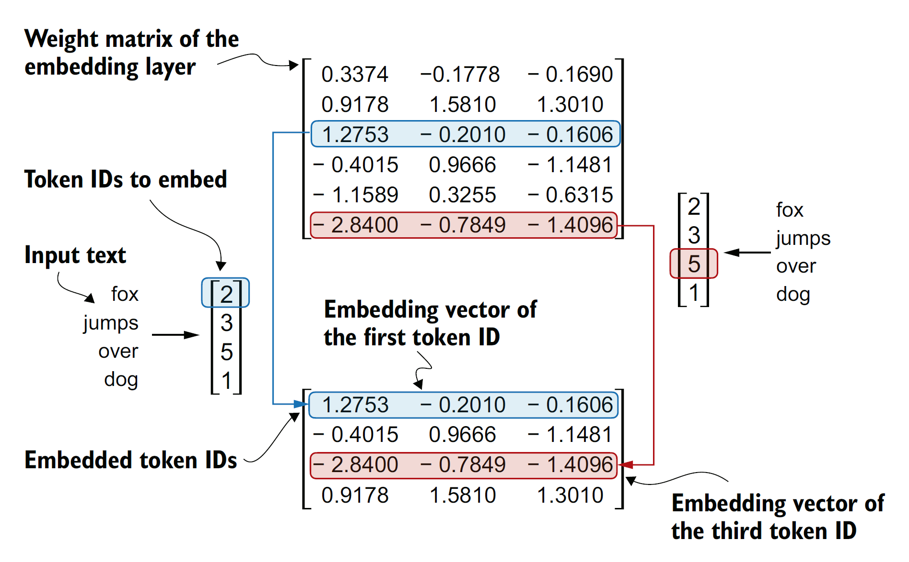

*Positional embeddings add location information to each token*

#### **The Position Problem in Transformers**

**RNNs** (Recurrent Neural Networks) process tokens sequentially:

$$
\mathbf{h}_t = f(\mathbf{h}_{t-1}, \mathbf{x}_t)
$$

→ **Implicit positional information** through temporal processing

**Transformers** process all tokens **in parallel**:

$$
\text{Attention}(\mathbf{Q}, \mathbf{K}, \mathbf{V}) = \text{softmax}\left(\frac{\mathbf{Q}\mathbf{K}^\top}{\sqrt{d_k}}\right)\mathbf{V}
$$

→ **No inherent notion of order!**

Without positional encoding:

$$
f([\text{"cat"}, \text{"chased"}, \text{"dog"}]) = f([\text{"dog"}, \text{"chased"}, \text{"cat"}])
$$

This is **catastrophic** for language understanding where word order determines meaning.

#### **GPT-2 Learned Positional Embeddings**

```python
max_length = 4
embedding_dim = 256

pos_embedding_layer = nn.Embedding(max_length, embedding_dim)
```

For each position $p \in \{0, 1, 2, 3\}$, a unique vector $\mathbf{p}_i \in \mathbb{R}^{256}$ is learned.

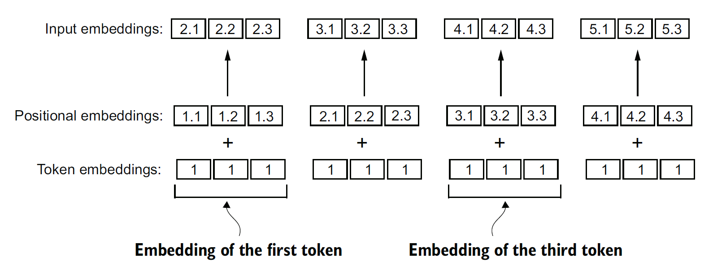

*Token embeddings and positional embeddings are combined via element-wise addition*

#### **Final Input to Transformer**

$$
\mathbf{z}_i = \mathbf{e}_{\text{token}_i} + \mathbf{p}_i
$$

Where:
- $\mathbf{e}_{\text{token}_i}$: **What** the token is (semantic content)
- $\mathbf{p}_i$: **Where** the token is (positional context)

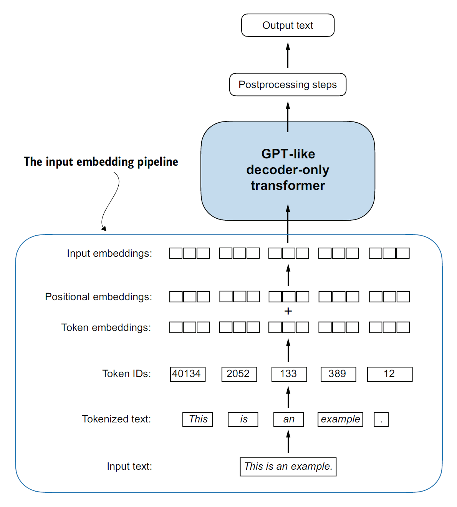

*Complete pipeline: text → tokens → token IDs → token embeddings + positional embeddings → LLM input*

#### **Why Addition (Not Concatenation)?**

**Addition** preserves dimensionality and allows the model to learn **position-aware features** through gradient descent.

**Example:**
```python
# Token embedding (what): [0.23, -0.15, 0.89, ...]
# Position embedding (where): [0.01, 0.02, 0.03, ...]
# Combined: [0.24, -0.13, 0.92, ...]  # Same dimensionality!
```

---

## 🔬 **Experimental Analysis**

### **Experiment: Impact of `max_length` and `stride` on Sample Generation**

**Research Question**: How do context window size and stride affect the number of training samples?

#### **Setup**

- **Dataset**: *"The Verdict"* by Edith Wharton
- **Tokenized Length**: $L = 5145$ tokens (using GPT-2 BPE)
- **Parameters Tested**:
  - `max_length`: `[4, 8, 16, 32]`
  - `stride`: `[1, max_length/2, max_length]`

#### **Results**

| `max_length` | `stride` | Samples Generated | Overlap Percentage |
|--------------|----------|-------------------|--------------------|
| 4 | 1 | 5,142 | 75% |
| 4 | 2 | 2,571 | 50% |
| 4 | 4 | 1,286 | 0% |
| 8 | 1 | 5,138 | 87.5% |
| 8 | 4 | 1,285 | 50% |
| 8 | 8 | 643 | 0% |
| 16 | 1 | 5,130 | 93.75% |
| 16 | 8 | 642 | 50% |
| 16 | 16 | 322 | 0% |
| 32 | 1 | 5,114 | 96.875% |
| 32 | 16 | 320 | 50% |
| 32 | 32 | 161 | 0% |

#### **Key Findings**

1. **Sample Count Scales Inversely with Stride**
   
   $$
   N_{\text{samples}} \propto \frac{1}{s}
   $$

   Reducing stride from `max_length` to `1` increases samples by **$m$x** (where $m$ is `max_length`).

2. **Overlap is Critical for Data Efficiency**
   - `stride = 1`: Each token appears in **$m$ different contexts**
   - `stride = max_length`: Each token appears in **exactly 1 context**
   
   **Implication**: For small datasets, `stride < max_length` is essential for generalization.

3. **Trade-off: Computational Cost vs. Data Richness**
   - **Small stride**: More samples → Longer training time, better generalization
   - **Large stride**: Fewer samples → Faster training, risk of underfitting

4. **Context Window Size Impact**
   - Larger `max_length` → Model sees more context per sample
   - However, requires more GPU memory and attention computation ($O(m^2)$ complexity)

#### **Recommendation for Production Systems**

| Use Case | Recommended `stride` | Rationale |
|----------|----------------------|-----------|
| **Small datasets (<10M tokens)** | `stride = 1` or `stride = max_length/4` | Maximize data utilization |
| **Large datasets (>1B tokens)** | `stride = max_length/2` or `max_length` | Balance efficiency and coverage |
| **Real-time inference** | N/A (stride only affects training) | Use pre-trained models |

---

## 🎯 **Key Insights**

### **1. Why BPE is Superior for LLMs**

- **Vocabulary Efficiency**: 50K tokens vs. 1M+ word-level tokens
- **Zero OOV Problem**: Any text can be tokenized, even unseen domain-specific terms
- **Morphological Awareness**: Subword units capture prefix/suffix patterns (e.g., `"running"` → `["run", "ning"]`)

### **2. The Role of Overlapping Context Windows**

Sliding windows with `stride < max_length` expose the model to **multiple contextual framings** of the same token:

```
"I HAD always thought Jack"

Context 1: [I, HAD, always] → predict "thought"
Context 2: [HAD, always, thought] → predict "Jack"
```

The token `"thought"` is learned both as:
- A **target** (position 3 in Context 1)
- A **context** (position 2 in Context 2)

This **bidirectional learning** improves the model's understanding of each token's role in language.

### **3. Embeddings as Learned Feature Representations**

Contrast with traditional machine learning:

| Traditional ML | LLM Embeddings |
|----------------|----------------|
| **Manual feature engineering** | **Automatic feature learning** |
| Features defined by domain experts | Features emerge from data via gradient descent |
| Example: *"stellar mass, temperature"* | Example: *"semantic similarity, syntactic role"* |

Embeddings transform the problem of **language understanding** into **geometry in a learned vector space**.

### **4. Positional Encoding Enables Parallel Processing**

Without positional embeddings, transformers would be **permutation-invariant** → unable to distinguish:
- `"The cat chased the dog"` ❌
- `"The dog chased the cat"` ❌

Positional embeddings **restore sequential order information** while maintaining the parallelization advantages of the transformer architecture:

- **RNNs**: Sequential processing → Slow, gradient issues
- **Transformers + Positional Encoding**: Parallel processing → Fast, stable

### **5. Architectural Lessons for Enterprise Systems**

| Principle | Application |
|-----------|-------------|
| **Modularity** | Each preprocessing step (tokenization, embedding, positioning) is independently tunable |
| **Scalability** | BPE tokenization and sliding windows scale to arbitrary text lengths |
| **Transferability** | Pre-trained embeddings (e.g., GPT-2, GPT-4) can be fine-tuned for domain-specific tasks |
| **Observability** | Each component produces interpretable intermediate outputs for debugging |

---

## 🚀 **Installation and Usage**

### **Prerequisites**

```bash
python >= 3.8
torch >= 2.0.0
tiktoken >= 0.7.0
jupyter >= 1.0.0
```

### **Local Execution**

```bash
# Clone repository
git clone https://github.com/JAPV-X2612/AREP-homework-3-llm-text-embeddings.git
cd AREP-homework-3-llm-text-embeddings

# Install dependencies
pip install torch tiktoken jupyter

# Download text data
wget https://raw.githubusercontent.com/rasbt/LLMs-from-scratch/main/ch02/01_main-chapter-code/the-verdict.txt

# Launch Jupyter Notebook
jupyter notebook embeddings.ipynb
```

### **Running the Notebook**

1. Open `embeddings.ipynb`
2. Execute cells sequentially (Shift + Enter)
3. Observe:
   - Tokenization outputs with BPE
   - DataLoader sample generation
   - Embedding layer initialization
   - Final input embeddings shape: `[batch_size, max_length, embedding_dim]`

### **Key Code Snippets**

#### **Tokenization**

```python
import tiktoken

tokenizer = tiktoken.get_encoding("gpt2")
token_ids = tokenizer.encode(raw_text)
print(f"Total tokens: {len(token_ids)}")  # ~5145
```

#### **Data Loader**

```python
from torch.utils.data import DataLoader

dataloader = create_dataloader_v1(
    raw_text, 
    batch_size=8, 
    max_length=4, 
    stride=1
)

inputs, targets = next(iter(dataloader))
print(inputs.shape)   # torch.Size([8, 4])
print(targets.shape)  # torch.Size([8, 4])
```

#### **Token Embeddings**

```python
import torch.nn as nn

vocab_size = 50257
embedding_dim = 256

token_embedding_layer = nn.Embedding(vocab_size, embedding_dim)
token_embeddings = token_embedding_layer(inputs)
print(token_embeddings.shape)  # torch.Size([8, 4, 256])
```

#### **Positional Embeddings**

```python
pos_embedding_layer = nn.Embedding(max_length, embedding_dim)
pos_embeddings = pos_embedding_layer(torch.arange(max_length))

input_embeddings = token_embeddings + pos_embeddings
print(input_embeddings.shape)  # torch.Size([8, 4, 256])
```

---

## 👥 **Author**

<table>
  <tr>
    <td align="center">
      <a href="https://github.com/JAPV-X2612">
        
        <br />
        <sub><b>Jesús Alfonso Pinzón Vega</b></sub>
      </a>
      <br />
      <sub>Full Stack Developer</sub>
    </td>
  </tr>
</table>

---

## 📄 **License**

This project is licensed under the **Apache License, Version 2.0** - see the [LICENSE](LICENSE) file for details.

---

## 🔗 **Additional Resources**

### **Primary Reference**
- [Build a Large Language Model (From Scratch)](http://mng.bz/orYv) - Sebastian Raschka
- [Official Book Repository](https://github.com/rasbt/LLMs-from-scratch)

### **Tokenization and BPE**
- [OpenAI tiktoken Library](https://github.com/openai/tiktoken)
- [Byte Pair Encoding Explained](https://huggingface.co/learn/nlp-course/chapter6/5)
- [SentencePiece: Unsupervised Text Tokenizer](https://github.com/google/sentencepiece)

### **Embeddings and Vector Representations**
- [Word2Vec Paper (Mikolov et al., 2013)](https://arxiv.org/abs/1301.3781)
- [GloVe: Global Vectors for Word Representation](https://nlp.stanford.edu/projects/glove/)
- [Understanding Word Embeddings](https://www.tensorflow.org/text/guide/word_embeddings)

### **Transformer Architecture**
- [Attention Is All You Need (Vaswani et al., 2017)](https://arxiv.org/abs/1706.03762)
- [The Illustrated Transformer](https://jalammar.github.io/illustrated-transformer/)
- [Positional Encoding in Transformers](https://kazemnejad.com/blog/transformer_architecture_positional_encoding/)

### **PyTorch and Deep Learning**
- [PyTorch Documentation](https://pytorch.org/docs/stable/index.html)
- [PyTorch nn.Embedding Layer](https://pytorch.org/docs/stable/generated/torch.nn.Embedding.html)
- [PyTorch DataLoader Tutorial](https://pytorch.org/tutorials/beginner/basics/data_tutorial.html)

### **LLM Training and Fine-Tuning**
- [GPT-2 Paper (Radford et al., 2019)](https://cdn.openai.com/better-language-models/language_models_are_unsupervised_multitask_learners.pdf)
- [GPT-3 Paper (Brown et al., 2020)](https://arxiv.org/abs/2005.14165)
- [Hugging Face Transformers Library](https://huggingface.co/docs/transformers/index)

### **Enterprise Architecture and MLOps**
- [AWS SageMaker Documentation](https://docs.aws.amazon.com/sagemaker/)
- [MLOps Best Practices](https://cloud.google.com/architecture/mlops-continuous-delivery-and-automation-pipelines-in-machine-learning)
- [Model Serving at Scale](https://www.nvidia.com/en-us/ai-data-science/products/triton-inference-server/)

### **Agentic AI Systems**
- [LangChain Documentation](https://python.langchain.com/docs/get_started/introduction)
- [Semantic Kernel by Microsoft](https://learn.microsoft.com/en-us/semantic-kernel/)
- [AutoGPT Project](https://github.com/Significant-Gravitas/AutoGPT)

---

**⭐ If you found this project helpful, please consider giving it a star! ⭐**
